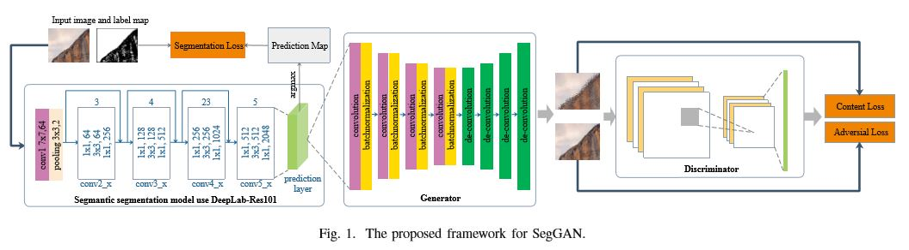
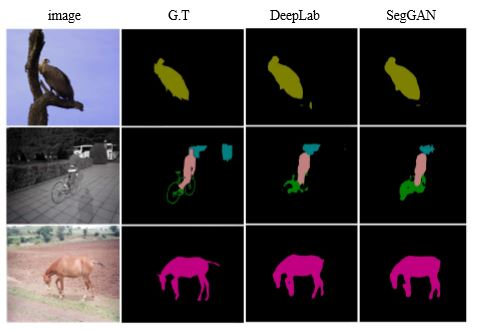

# note-for-SegGANv2
make notes foe SegGANv2

论文名称：SegGAN: Semantic Segmentation with Generative Adversarial Network

论文地址：[https://ieeexplore.ieee.org/document/8499105](https://ieeexplore.ieee.org/document/8499105)

这篇论文是发表在2018 IEEE Fourth International Conference on BigMM上的论文。与之前最原始的SegGAN不同，这篇论文并不是由输入图像来生成mask，而是反其道而行之，由mask来重建原始图像，也就是说，这篇论文里的generator是学习mask到original image的一个mapping。

具体网络结构如下图：

如上图，整个网络可以看成是两个部分：前半部分是一个已经存在的训练好的分割网络，用来得到一个coarse output mask，这篇论文中用的是DeepLab-Res101。主要基于两个原因：第一，DeepLab推理时间快；第二，像CNN和CRF可以作为分割图像后期处理的结构可以和DeepLab很好的结合。后半部分是一个GAN model，包含一个生成器和一个判别器。生成器主要是学习如何由前面分割网络得到的mask来重建原始图像，包括4个卷积层和4个反卷积层，以及随机的dropout防止过拟合；而判别器的工作是正确判断输入的到底是真实的原始图像还是生成器生成的虚假的重建图像，包括4个卷积层和relu激活函数层。

网络的训练也是分两个阶段：第一阶段，先用内容损失和对抗损失来训练后半部分的GAN model；等GAN model训练好之后，在第二阶段，将前半部分的Segment model和后半部分的GAN model合成一个整体，然后用自定义的损失函数（分割损失mce+内容损失mse+对抗损失bce）来端到端的训练，从而实现对分割网络参数的fine-tuning，而此阶段GAN model的参数是不更新的（fixed）。整个网络训练好之后，在测试阶段只用到Segment model来得到预测的mask。

实验结果：

Word and Expression:

- long standing challenging issue   长期存在的挑战
- concretely = specifically
- Numerous experiments conducted on ... demonstrate the effectiveness of ...
- ... had become the mainstream
- push ... to soaring heights   推向一个高度，飞速发展
- the problems of accurate boundary extraction and areas prediction still remain to be the challenging tasks.   分割问题的挑战
- achieves promising performance against state-of-the-art works
- Section 3 deals with ...   概括可用deal with
- accommodate   容纳
- admittedly   固然
- despite having those defects
- the learned GAN is treated as a kind of loss to fine-tune the semantic segmentation model